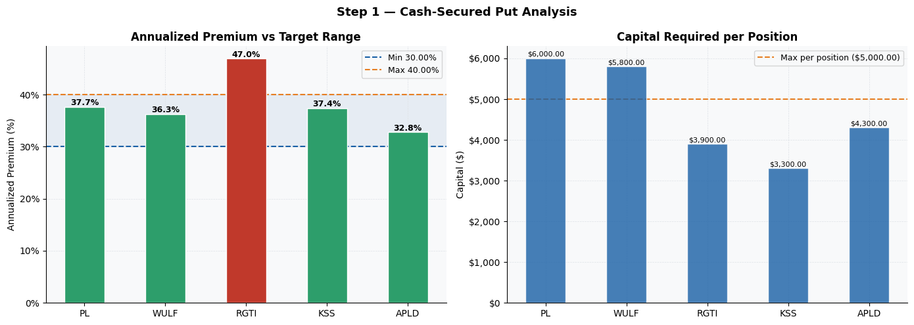
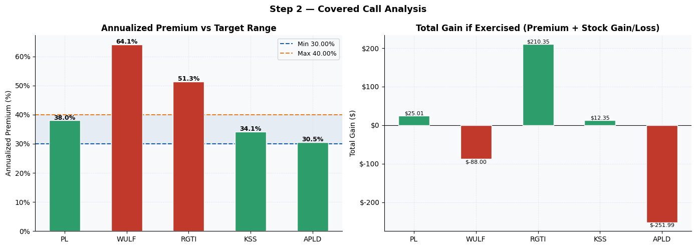
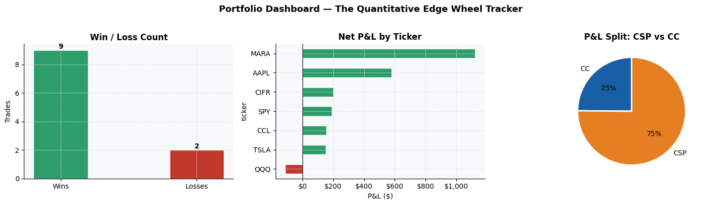

# 🎡 Wheel Strategy Toolkit
### A complete pre-trade and post-trade Python system for systematic options traders
### by [Fabio Baruffa](https://fabiobaruffa.com) — The Quantitative Edge

[](https://fabiobaruffa.com)
[](LICENSE)

---

## What is this?

The Wheel Strategy is one of the cleanest income strategies in options trading. But two problems kill most wheel traders:

1. **Entering bad trades** — selling puts or calls that don't meet your parameters because you eyeballed the numbers in a spreadsheet
2. **Letting one position quietly destroy the portfolio** — no system to flag when a single name has grown into a dangerous concentration

I built this toolkit to solve both. It covers the entire wheel workflow — from evaluating a trade before entry, to tracking every position and monitoring drawdown over time.

It started as an Excel spreadsheet and a manual journal. After a painful drawdown on MARA in 2025 — where averaging down concentrated my exposure in a stock in a structural downtrend — I rebuilt it properly in Python. These two notebooks are what I use every week.

---

## The Toolkit — Two Notebooks

### 📊 Notebook 1: Wheel Calculator (`wheel_calculator.ipynb`)
**Use before entering a trade.**

Evaluates up to 5 put or call candidates side by side and tells you instantly whether each one meets your parameters. No more eyeballing premium yields in a spreadsheet.

| Section | What it does |
|---|---|
| 🏦 Portfolio Settings | Set your buying power, max positions, and target annualized range (default: 30–40%) |
| 📉 Step 1: CSP Analysis | Strike, premium, commission, expiry → net credit, $/day, annualized return, capital required, drop % |
| 📈 Step 2: CC Analysis | Assigned price, shares, strike → annualized return, rise %, total gain if exercised, strike rule check |
| 📊 Visual Parameter Check | Color-coded charts — green = within parameters, red = outside |
| 📋 Trade Decision Summary | Single go/no-go view of all candidates before placing any order |

**Rules enforced automatically:**
- Call Strike ≥ Assigned Price (flags any position that would lock in a loss if exercised)
- Annualized premium within your 30–40% target range
- Total capital required vs buying power check

---

### 📒 Notebook 2: Wheel Tracker (`wheel_strategy_tracker.ipynb`)
**Use after entering a trade — and every month.**

Logs every CSP and Covered Call, monitors per-ticker drawdown, and generates the monthly P&L reporting I publish in The Quantitative Edge Newsletter.

| Section | What it does |
|---|---|
| 📋 Trade Log | Log every CSP and CC with strike, premium, contracts, status, exit price |
| 📊 Portfolio Dashboard | Win rate, total premium collected, net P&L, charts by ticker and strategy |
| 🚨 Drawdown Monitor | Flags any ticker breaching your drawdown threshold — the MARA lesson, built in |
| 📈 Monthly Performance | Equity curve and month-by-month return table, newsletter-ready |
| 💾 CSV Export | One-click export of your full trade journal |

---

## Screenshots

**Wheel Calculator — Cash Secured Put Analysis**


**Wheel Calculator — Covered Call Analysis**


**Wheel Tracker — Portfolio Dashboard**


---

## The workflow — how the two notebooks work together

```
New trade candidate
        ↓
Wheel Calculator — does it meet my parameters?
  ✅ Annualized premium 30–40%?
  ✅ Call strike ≥ assigned price?
  ✅ Capital within buying power?
  ✅ No earnings within DTE window?
        ↓ all green → enter the trade
        ↓
Wheel Tracker — log the position
        ↓
Monitor weekly — drawdown alerts, open exposure
        ↓
End of month — run tracker, generate P&L report
        ↓
Newsletter / personal journal
```

---

## ⚠️ Get the full toolkit

This repository contains **preview content only** — the README and screenshots showing what the notebooks produce. The `.ipynb` files are not published here.

The complete Wheel Strategy Toolkit — both working notebooks — is available  **free to subscribers** of The Quantitative Edge newsletter.

👉 **[Subscribe at fabiobaruffa.com](https://fabiobaruffa.com)** and the toolkit lands in your inbox automatically.

Once you have the notebooks, open them in Google Colab — no Python installation required, runs in your browser in 30 seconds.

### Option 2: Local Jupyter
```bash
git clone https://github.com/fbaru-dev/wheel-strategy-toolkit.git
cd wheel-strategy-toolkit
pip install -r requirements.txt
jupyter notebook
```

### Requirements (if running locally)
```
pandas
numpy
matplotlib
jupyter
```

---

## How to use the Calculator (before every trade)

1. Run the **Setup** cell
2. Set your **Portfolio Settings** — buying power, max positions, annualized target
3. Fill in your **put candidates** in Step 1 — ticker, stock price, strike, premium, commission, expiry, contracts
4. Fill in your **covered call positions** in Step 2 — assigned price, shares, strike, premium, commission, expiry
5. Run all cells — `Runtime → Run all` in Colab
6. Check the **Trade Decision Summary** — go/no-go before placing any order

---

## How to use the Tracker (ongoing)

1. Run the **Setup** cell
2. **Edit the Trade Log** (Section 1) — add each trade as a row. Update status as trades close or get assigned
3. **Set your drawdown threshold** (Section 3) — default is 15% per ticker
4. **Set your account size** (Section 4) — for accurate monthly return calculation
5. Run all cells at the end of each month to generate your performance report
6. **Export** (Section 5) — timestamped CSV of your full trade journal

---

## About the author

I'm Fabio — a physicist with a PhD in Quantum Computing, former HPC and Cloud Specialist at Intel and AWS, Lead Cloud Consultant, and systematic options trader for several years.

The MARA position in 2025 taught me that position sizing matters more than conviction, and that drawdown control must take priority over premium generation. Both lessons are built directly into this toolkit — the Calculator stops you from entering the wrong trade, the Tracker stops you from holding it too long.

I write about quantitative trading, options strategies, and Python at **[The Quantitative Edge](https://fabiobaruffa.com)** — a newsletter for traders who approach the market like scientists.

---

## License

MIT — free to use for personal trading. Not financial advice.

---

*© The Quantitative Edge — fabiobaruffa.com*
